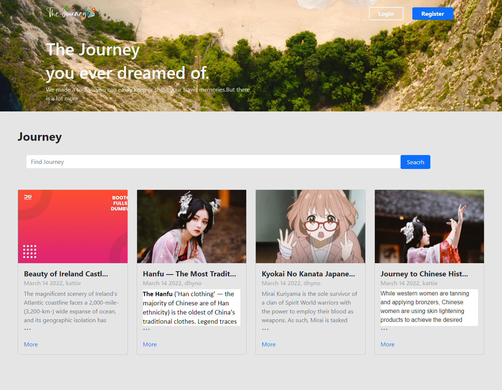

# JOURNEY APP

### Stacks
- React.Js
- React Context
- React Bootstrap
- Express Js
- Mysql
- Sequelize Js


### Dependencies
- React Router Dom
- Axios
- Draft-js
- draftjs-to-html
- React-avatar-editor
- React-draft-wysiwyg
- Ract-vanilla-tilt
- Multer
- Json Webtoken
- Bcrypt
- Concurrently
- Cors
- Dotenv
- Joi
- Multer
- Nodemon
- Cloudinary

Clone the repository :

```
git clone https://github.com/Rino-Saputra/journey-app
```

Switch to the repo folder :

```
cd journey-app/client
```

Install all the dependencies using `npm` or you can using `yarn` :

```
npm install or yarn install
```

```
cd ../server
```

Install all the dependencies using `npm` or you can using `yarn` :

```
npm install or yarn install
```

install xampp/mampp/lampp depend on computer Os

click start apache and mysql

open directory work on code editor

```
npx sequelize-cli db:migrate
```

Run the server :

```
npm run dev
```

get access the server at http://localhost:3000

## [DEMO](https://journey-app-rino.netlify.app/)

- 